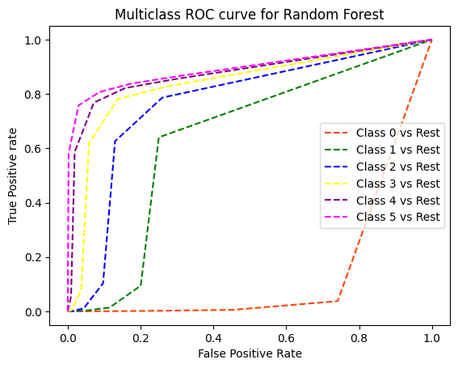
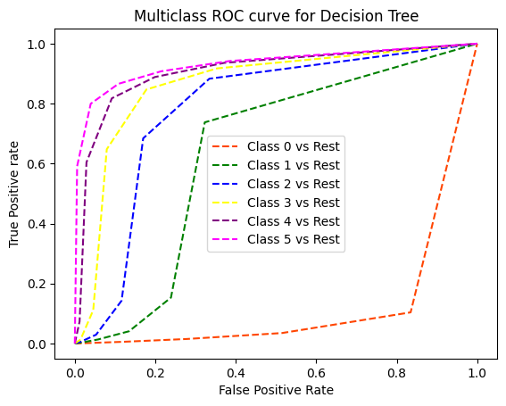
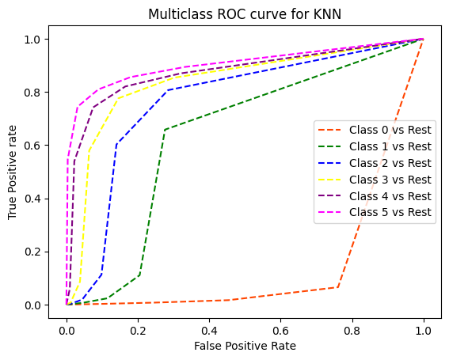
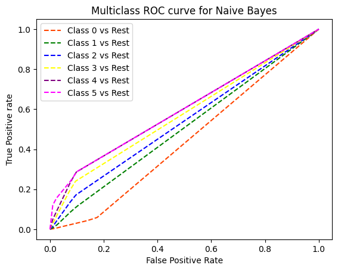

# 🌵 Drought Prediction using Machine Learning

## 📖 Abstract

This project provides a comparative analysis of various machine learning algorithms for predicting drought severity in the United States. Using a comprehensive dataset of meteorological indicators, we develop and evaluate several classification models to forecast drought levels, which are categorized on a scale from 0 (no drought) to 5 (exceptional drought).

The primary goal is to determine if droughts can be accurately predicted using only meteorological data, potentially enabling the generalization of these models to other regions globally. The project follows a complete data science workflow, including data wrangling, exploratory data analysis (EDA), feature selection, and model evaluation. Our findings indicate that the **Random Forest** algorithm delivers the most accurate and reliable predictions for this task.

---

## 📊 Dataset

The data for this project is the [U.S. Drought Meteorological Data](https://www.kaggle.com/datasets/cdminix/us-drought-meteorological-data) from Kaggle. It contains weekly drought scores for various U.S. counties, along with 18 daily meteorological indicators for the preceding 90 days.

* **Target Variable**: `score` - An integer from 0 to 5 representing the drought severity.
* **Features**: 18 meteorological indicators, including:
    * `PRECTOT`: Precipitation (mm/day)
    * `PS`: Surface Pressure (kPa)
    * `QV2M`: Specific Humidity at 2 Meters (g/kg)
    * `T2M`: Temperature at 2 Meters (°C)
    * `WS10M`: Wind Speed at 10 Meters (m/s)
    * `WS50M`: Wind Speed at 50 Meters (m/s)
    * ...and other temperature, wind, and pressure-related metrics.

The dataset is notably **imbalanced**, with a majority of data points corresponding to "no drought" conditions.

---

## ⚙️ Methodology

The project was structured around a standard machine learning lifecycle:

1.  **Data Wrangling & Preprocessing**:
    * Loaded the timeseries data and handled missing values by dropping rows where the `score` was null.
    * Engineered new temporal features (`year`, `month`, `day`) from the `date` column.
    * Cleaned the data by removing outliers that fell beyond three standard deviations from the mean for each meteorological feature.

2.  **Exploratory Data Analysis (EDA)**:
    * Conducted univariate analysis to understand the distribution of each continuous and categorical variable.
    * Performed bivariate analysis to identify relationships and correlations between features. A correlation heatmap revealed strong positive correlations among temperature-related and wind-speed-related variables.

3.  **Feature Selection**:
    * Applied **Recursive Feature Elimination (RFE)** with a Random Forest base estimator to select the 15 most impactful features.
    * Features such as `PRECTOT`, `T2MWET`, and `month` were eliminated to improve model performance and reduce complexity.

4.  **Model Development & Evaluation**:
    * The preprocessed data was split into an 80% training set and a 20% testing set.
    * Features were standardized using `StandardScaler`.
    * Four different classification algorithms were trained and evaluated:
        * Decision Tree
        * K-Nearest Neighbors (KNN)
        * Gaussian Naive Bayes
        * Random Forest
    * Model performance was assessed using Accuracy, Precision, Recall, F1-Score, and Cohen's Kappa Score.

---

## 🚀 Results & Performance

After training and evaluating all models, the **Random Forest** algorithm emerged as the top performer. It demonstrated the highest accuracy and the best balance between precision and recall, making it the most reliable model for this prediction task.

### Performance Comparison

| Algorithm       | Accuracy | Precision | Recall | F1 Score | Cohen Kappa Score |
| :-------------- | :------- | :-------- | :----- | :------- | :---------------- |
| **Random Forest** | **0.795**| **0.781** | **0.795**| **0.783**| **0.627** |
| Decision Tree   | 0.763    | 0.762     | 0.763  | 0.763    | 0.596             |
| KNN             | 0.769    | 0.450     | 0.769  | 0.760    | 0.588             |
| Naive Bayes     | 0.585    | 0.450     | 0.585  | 0.480    | 0.081             |

### ROC Curves

The Receiver Operating Characteristic (ROC) curves below visualize the performance of each model in distinguishing between the different drought severity classes.

| Random Forest                                                              | Decision Tree                                                                  |
| -------------------------------------------------------------------------- | ------------------------------------------------------------------------------ |
|  |  |
| **KNN** | **Naive Bayes** |
|                     |        |

---

## ⚠️ Challenges

Throughout the project, we encountered several challenges:

* **Data Uncertainty**: The dataset contained missing values and required significant outlier treatment.
* **Non-Linearity**: The relationships between meteorological variables and drought are complex and non-linear, which posed a challenge for simpler models.
* **Computational Resources**: Training models, especially with techniques like SVM kernels (which were explored but not included in the final report due to this constraint), was computationally intensive.
* **Hyperparameter Tuning**: Finding the optimal hyperparameters for each model was a time-consuming process that required extensive experimentation.

---

## 💻 How to Run
``` It requires an approximate time of 2 hrs to run the whole code```
``` Better see the colab notebook to view the Results```
To run this project, you will need Python 3 and the following libraries:

* pandas
* numpy
* scikit-learn
* matplotlib
* seaborn

1.  **Clone the repository:**
    ```bash
    git clone [https://github.com/your-username/drought-prediction.git](https://github.com/your-username/drought-prediction.git)
    cd drought-prediction
    ```

2.  **Install the required libraries:**
    ```bash
    pip install pandas numpy scikit-learn matplotlib seaborn
    ```

3.  **Run the script:**
    The main script `final_drought_prediction_using_ml_algorithms.py` will automatically download the dataset from Kaggle, preprocess the data, train the models, and print the performance evaluation metrics.
    ```bash
    python final_drought_prediction_using_ml_algorithms.py
    ```

---

## 👨‍💻 Contributors

This project was developed as part of the Bachelor of Technology program at Haldia Institute of Technology.

* **Kritik Tiwary**
* **Mayank Kumar**
* **Priyanshu**
* **Rahul Raman**

Under the guidance of **Dr. Arindam Giri**.
